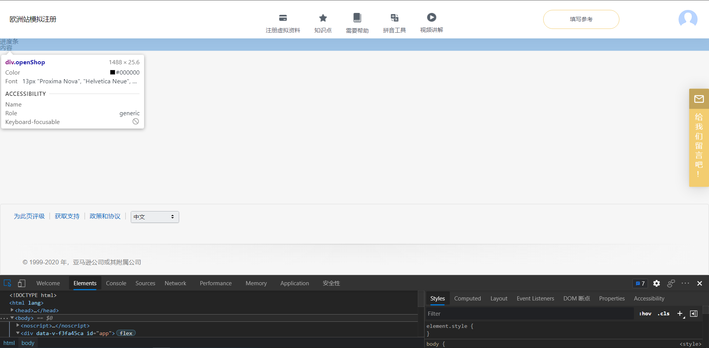
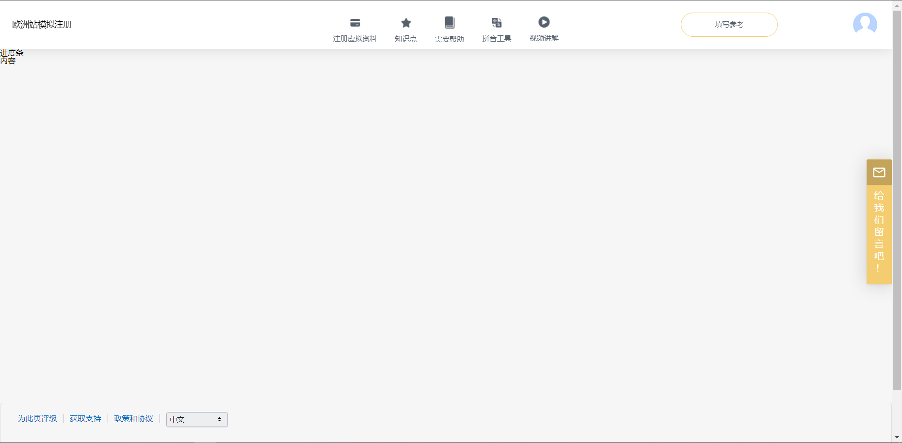

# 元素居中

``` html
<div class="parent" style="width: 100px; height:100px; background-color: aqua;">
	<div class="center" style="width: 80px; height:80px; background-color: burlywood;">
        <span>center</span>
    </div>    
</div>
```

## 行内元素

``` css
/* 水平居中 */
.center {
    text-align: center;
}
/* 用line-height */

/* 垂直居中 */

/* 转换成块元素、弹性盒子进行垂直居中 */
```

<div class="parent" style="float: left; width: 100px; height:100px; background-color: aqua;">
	<div class="center" style="text-align: center; width: 80px; height:80px; background-color: burlywood;">
        <span style="">center</span>
    </div>    
</div>
<div style="clear: both;"></div>

## 块元素

``` css
/* margin水平居中1 */
.center {
    margin: 0 auto;
}

/* margin水平居中2 */
.center {
    margin-left: 50%;
    transform: translateX(-50%);
}

/* margin垂直居中1 */
.center {
    margin-top: 50%;
    transform: translateY(-50%);
}

/* position设置absolute left水平top垂直+transform进行居中 */
.parent {
    position: relative; /* absolute、fixed、...（除static外）*/
}
.center {
    position: absolute; 
    top: 50%;
    left: 50%
    transform: translate(-50%, -50%);
}
```

<div class="parent" style="float: left; width: 100px; height:100px; background-color: aqua;">
	<div class="center" style="margin: 0 auto; width: 80px; height:80px; background-color: burlywood;">
        <span style="">margin水平居中1</span>
    </div>    
</div>
<div class="parent" style="float: left; margin-left: 30px; width: 100px; height:100px; background-color: aqua;">
	<div class="center" style="margin-left: 50%; transform: translateX(-50%); width: 80px; height:80px; background-color: burlywood;">
        <span style="">margin水平居中2</span>
    </div>    
</div>
<div class="parent" style="float: left; margin-left: 30px; width: 100px; height:100px; background-color: aqua;">
	<div class="center" style="margin-top: 50%; transform: translateY(-50%); width: 80px; height:80px; background-color: burlywood;">
        <span style="">margin垂直居中1</span>
    </div>    
</div>
<div class="parent" style="float: left; position: relative; margin-left: 30px; width: 100px; height:100px; background-color: aqua;">
	<div class="center" style="position: absolute; left:50%; top: 50%; transform: translate(-50%, -50%); width: 80px; height:80px; background-color: burlywood;">
        <span style="">left+top+transform进行居中</span>
    </div>    
</div>
<div style="clear: both;"></div>

## 弹性盒子

``` css
/* flex水平垂直居中 */
.center {
    display: flex;
    flex-direction: row; /* 当方向为column时,主轴与垂直轴相反 */
    align-items: center; /* 垂直轴: 垂直居中 */
    justify-content: center; /* 主轴: 水平居中 space-around也可以*/
}
```

<div class="parent" style="float: left; width: 100px; height:100px; background-color: aqua;">
	<div class="center" style="display: flex; flex-direction: column; align-items: center; justify-content: center; width: 80px; height:80px; background-color: burlywood;">
        <span style="">center</span>
    </div>    
</div>
<div style="clear: both;"></div>

# css实现三角形

## 应用在下拉选择框


# css实现步骤线


# 线性变换线

实现一条颜色过渡好看的基线

```html
<div class="line"></div>
```

```css
/* background 是linear-gradient要附加浏览器支持 */
/* 加入 -webkit-linear-gradient支持 Safari、Chrome、Webkit引擎, 注:移动端基本都是webkit引擎*/
/* 加入 -moz-linear-gradient支持 Firefox、GEcko引擎*/
/* 加入 -ms-linear-gradient支持 IE、Trident引擎*/
.line {
    height: 40px;
    background: linear-gradient(to bottom, rgba(0,0,0,.14), rgba(0,0,0,.03) 3px, transparent);
}
.line::after {
    display: block;
    background-color: transparent;
    background: linear-gradient(to right, #f6f6f6, rgba(255, 255, 255, 0), #f6f6f6);
    width: 100%;
    height: 100%;
    content: "";
}
```

- 效果:

<div style="height: 40px; background: linear-gradient(to bottom, rgba(0,0,0,.14), rgba(0,0,0,.03) 3px, transparent);">
	<div style="padding-top: 20px; background-color: transparent; height: 100%; background: linear-gradient(to right, #f6f6f6, rgba(255,255,255,0), #f6f6f6);">
        好看的渐变效果线
    </div>
</div>

# 自适应高度的底部footer

页面中有底部

- 当高度不够时，底部显示在最底部
- 高度足够时，底部被挤下去

``` html
<div class="app">
    <div class="content">
        内容
    </div>
    <div class="footer">
        底部
    </div>
</div>
```

``` css
.app {
    display: flex;
    flex-direction: column;
    justify-content: space-between;
    min-height: 100vh;
}
.content {
    height: 10px; /* 页面高度不足 */
}
.content {
    height: 100vh; /* 页面高度足够 */
}
```

这里不做演示，`vh`不好演示，效果如图

## 页面高度不足

底部显示在最下面，紧贴浏览器



## 页面高度足够

底部被内容挤到下面，显示下拉框

